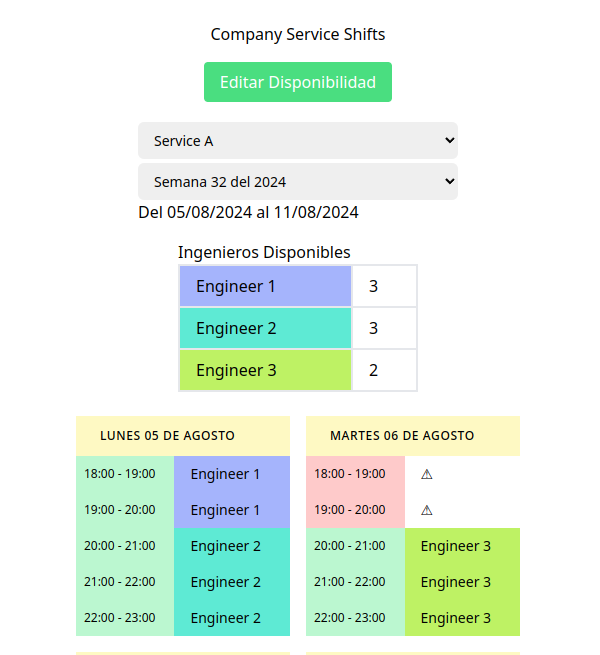

## Monitoring Schedule

### Resumen
- Contexto:
  - Coordinar los turnos de guardia para cada servicio monitoreado por semana

- Sistema que permite:
  - Indicar la **disponibilidad de tiempo en la semana** de cada ingeniero del equipo
  - **Asignar a ingenieros a turnos** de monitoreo de servicios.
  - Visualizar los turnos asignados
#### Features
1. Gestión de Turnos: 
  - Facilita la visualización de los turnos asignados 
  - Asegura que la información sobre las horas sin asignar sea clara y accesible.
2. Gestión de Disponibilidad: 
  - Permite a los ingenieros 
    1. Seleccionar el servicio y la semana, 
    2. Visualizar su disponibilidad 
    3. Marcar su disponibilidad.
### Modo de uso:
1. Los ingenieros se reunen para organizar su disponibilidad y turnos
2. Se revisa los turnos indicados por el servicio de empresa para esa semana
3. Se pasa a consultar a cada ingeniero (segun el servicio que le toca esa semana) su disponibilidad para esa semana. Al finalizar se presiona en "Guardar".
4. Se regresa a revisar los turnos asignados automaticamente para la semana segun el servicio.

### Componentes
#### Endpoints - Gestion de Turnos (Shifts)
- 1st Dropdown (Services)
  - GET /api/company_services
  - [example response](frontend/src/mock/company_services.json)
- 2nd Dropdown (Weeks)
  - GET /api/company_services/:id/weeks 
  - [example response](frontend/src/mock/weeks_service_a.json)
- Engineers Table
  - GET /api/company_services/:id/engineers?week=YYYY-WW 
  - [example response](frontend/src/mock/engineers_a_w1.json)
- Shifts Table
  - GET /api/company_services/:id/shifts?week=YYYY-WW
  - [example response](frontend/src/mock/shifts_a_w1.json)
#### Endpoints - Gestion de Disponibilidad (Availability)
- Dropdowns anteriores (gestion de turnos) para el filtrado y llenado de semana
- Boton Editar Disponibilidad: Consultar Disponibilidad de ingenieros
  - GET /api/company_services/:id/engineers/availability?week=YYYY-WW
  - [example response](frontend/src/mock/eng_availability_a_w1.json.json)
- Updates Engineer Availability 
  - POST /api/company_services/:id/engineers/availability
    - week
    - availability (array)
      - engineer_id
      - time_blocks (array)
        - day
        - start_time
        - end_time
        - available


#### Modelos
1. Servicios monitoreados
  - Contrato: Fechas Establecidas
2. Engineer
3. CompanyServiceEngineer
  - Asignar 3 ingenieros encargados del servicio durante el contrato.
4. Shift (Turno) - bloques de 1 hora
  - Contrato: Horas por dia de semana establecidas (grupo de bloques)
5. EngineerShift
  - Bloque asignado a ingeniero
6. Availability (Disponibilidad) - Must: engineer

#### Modelos - Instancias Ejemplo
1. CompanyService
  id: 1
  name: "Service A"
	contract_start_date: "2024-08-01"
  contract_end_date: "2024-08-31"

2. Engineer
  id: 1
  name:"Alice Smith"
  color:"Bob Johnson"

3. Shift
	company_service:1
  engineer:(sin asignar)
	week:"2024-32"
  day:"Monday"
  start_time:"2024-08-07 09:00:00"
  end_time:"2024-08-07 10:00:00"
  
4. Availability
	engineer:1
  week:"2024-32"
  day:"Monday"
  start_time:"2024-08-07 09:00:00"
  end_time:"2024-08-07 10:00:00"
  available:true

#### Modelos - Instancias Factory Bot
```ruby
# 1. CompanyService
FactoryBot.attributes_for :company_service
=> {:name=>"Farrell, Mohr and Haley", :contract_start_date=>Thu, 18 Jul 2024, :contract_end_date=>Tue, 20 Aug 2024}

# 2. Engineer
FactoryBot.attributes_for :engineer
=> {:name=>"Russell Hermann", :color=>"#0c0d0d"}

# 3. CompanyServiceEngineer
#FactoryBot.attributes_for :company_service_engineer

# 4. Shift
FactoryBot.attributes_for :shift
=> {:week=>"2024-32", :day=>"Tuesday", :start_time=>"13:00", :end_time=>"18:00"}
# 5. EngineerShift

# 6. Availability
FactoryBot.attributes_for :availability

```

#### Arquitectura Frontend (Grafica Figma)
- View
  - Components
    - provider: useShiftManagement
      - CompanyServiceApi.ts
#### Arquitectura Backend (Grafica Figma)


### Ejecución
#### Ambiente de desarrollo
- Se ha usado Devcontainer y docker-compose para facilitar el desarrollo usando contenedores y vscode
- https://code.visualstudio.com/docs/devcontainers/containers

- Pasos para ejecutar:
  - Tener instalado la extension Devcontainer en vscode
  - Abrir el proyecto en vscode
  - Ejecutar el contenedor Rails API Container:
      - abrir command palette: ctrl + shift + p
      - Seleccionar: Reopen in container
      - Seleccionar: "Rails API Container"
      - Dentro ejecutar: 
        ```bash
        rails db:setup
        rails s -b 0.0.0.0
        ```
  - Ejecutar el contenedor Vue Container:
      - abrir command palette: ctrl + shift + p
      - Seleccionar: Reopen in container
      - Seleccionar: "Vue Container"
      - Dentro ejecutar mocked: `yarn dev`
      - (alternativa) Dentro ejecutar api: `yarn serve:api`
  - navegar a 0.0.0.0:8080 para empezar a usar la app
- Ejecutar tests e2e:
  ```bash
  # Conectarse a contenedor de playwright
  docker exec -it monit-playwright /bin/bash
  # ejectuar tests
  yarn test:e2e
  ```


#### Alternativa:
- usar directamente docker-compose up desde la ruta base
```bash
docker-compose -f .devcontainer/docker-compose.yml up
# verificar los servicios
```

- navegar a 0.0.0.0:8080 para empezar a usar la app


### Screenshots
#### Ejecución



#### Figma

